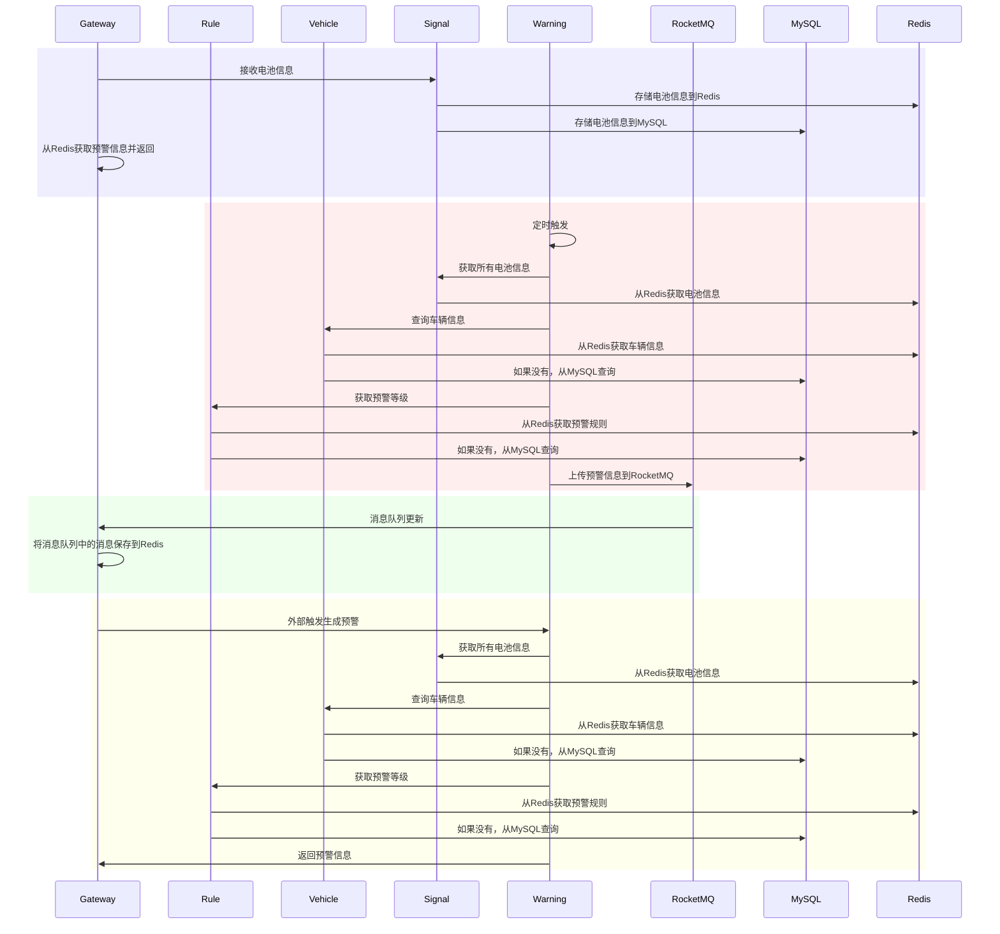

# 系统架构设计

系统架构分为五个模块：**gateway**、**rule**、**vehicle**、**signal** 和 **warning**，各模块通过 **Dubbo** 和 **Nacos** 进行通信。

## 模块职责

**gateway**  
负责接收外部信息并发送消息  
接收到信息后，调用 **signal** 模块进行存储，数据保存到 Redis 和 MySQL 中  
在返回时，从本地 Redis 获取最新的车辆预警信息并返回  
每当 **gateway** 发现消息队列有更新时，会将更新的预警信息保存到本地 Redis

**rule**  
负责对传入的车辆信息进行判断，并确定预警等级  
优先从 Redis 获取信息，若 Redis 中没有相关数据，则会从 MySQL 中查询

**vehicle**  
负责查询车辆信息，并为预警生成提供必要的数据  
优先从 Redis 获取信息，若 Redis 中没有相关数据，则会从 MySQL 中查询

**signal**  
负责处理电池信息，包括保存到 Redis 和 MySQL  
每当新的电池信息到来时，**signal** 会同时保存到 Redis 和 MySQL 中

**warning**  
负责定时生成预警，每 0.5 秒调用 **signal** 模块的 `getAllBatterySignal()` 方法，获取当前存储在 Redis 中的所有车辆信息  
通过 **vehicle** 和 **rule** 生成预警等级，并将预警信息上传到消息队列  
**warning** 也可以外部触发生成预警

## 系统架构优点

**微服务 + DDD**  
系统采用微服务架构，配合领域驱动设计（DDD），每个模块职责单一，易于扩展和维护

**Dubbo**  
使用 Dubbo 实现模块间的高效、可靠通信，提供了强大的分布式服务治理能力

**模块化设计**  
每个模块都可以独立开发、部署和扩展，保证了系统的灵活性

**高可扩展性**  
模块间松耦合，可按需扩展每个模块，特别适用于高并发和高负载场景

**模块间的异步通信**  
通过消息队列和定时任务，模块间的通信采用异步方式，确保系统解耦并提升了并发处理能力

**解耦与高并发处理**  
异步通信和定时任务确保模块间的低耦合性，同时增强了系统在高并发场景下的响应速度和处理能力



```sql
-- 删除现有数据库（如果存在）
DROP DATABASE IF EXISTS battery_warning_system;

-- 创建数据库
CREATE DATABASE battery_warning_system;

-- 使用该数据库
USE battery_warning_system;

-- 删除现有表（如果存在）
DROP TABLE IF EXISTS battery_signal;
DROP TABLE IF EXISTS warning_rule;
DROP TABLE IF EXISTS battery_vehicle;
DROP TABLE IF EXISTS alert_message;

-- 创建车辆信息表
CREATE TABLE battery_vehicle (
                                 id INT PRIMARY KEY AUTO_INCREMENT,  -- 自增ID
                                 vid INT NOT NULL,                   -- 车架编号
                                 battery_type VARCHAR(50) NOT NULL,  -- 电池类型 (三元电池 / 铁锂电池)
                                 total_mileage INT NOT NULL,         -- 总里程 (单位：km)
                                 battery_health INT NOT NULL,        -- 电池健康状态 (百分比)
                                 created_at TIMESTAMP DEFAULT CURRENT_TIMESTAMP, -- 插入时间，自动生成
    -- 为 vid 字段添加索引
                                 INDEX idx_vid (vid)
) ENGINE=InnoDB DEFAULT CHARSET=utf8;

-- 创建预警规则表
CREATE TABLE warning_rule (
                              id INT PRIMARY KEY AUTO_INCREMENT,  -- 自增ID
                              warn_type INT NOT NULL,             -- 预警类型：1（电压差）、2（电流差）
                              battery_type VARCHAR(50) NOT NULL,  -- 电池类型（如：三元电池、铁锂电池）
                              range_start DOUBLE NOT NULL,        -- 差值范围开始
                              range_end DOUBLE NOT NULL,          -- 差值范围结束
                              alert_level INT NOT NULL,           -- 报警等级
                              status INT DEFAULT 1,               -- 状态：1 启用，0 禁用
                              created_at TIMESTAMP DEFAULT CURRENT_TIMESTAMP,  -- 记录创建时间
                              updated_at TIMESTAMP DEFAULT CURRENT_TIMESTAMP ON UPDATE CURRENT_TIMESTAMP,  -- 记录更新时间
    -- 为 warn_type 和 battery_type 添加复合索引
                              INDEX idx_warn_type_battery_type (warn_type, battery_type),
    -- 为 status 字段添加索引
                              INDEX idx_status (status)
) ENGINE=InnoDB DEFAULT CHARSET=utf8;

-- 创建电池信号表
CREATE TABLE battery_signal (
                                id INT PRIMARY KEY AUTO_INCREMENT,  -- 自增ID
                                car_id INT NOT NULL,                -- 车架编号
                                warn_id INT NOT NULL,               -- 规则编号
                                max DOUBLE NOT NULL,                -- 最高电压 (Mx) 或 最高电流 (Ix)
                                min DOUBLE NOT NULL,                -- 最小电压 (Mi) 或 最小电流 (Ii)
                                created_at TIMESTAMP DEFAULT CURRENT_TIMESTAMP, -- 插入时间，自动生成
    -- 为 car_id 和 warn_id 添加复合索引
                                INDEX idx_car_id_warn_id (car_id, warn_id),
    -- 为 created_at 添加索引
                                INDEX idx_created_at (created_at)
) ENGINE=InnoDB DEFAULT CHARSET=utf8;

-- 创建预警信息表
CREATE TABLE alert_message (
                               id INT PRIMARY KEY AUTO_INCREMENT,  -- 自增ID
                               car_id INT NOT NULL,                -- 车架编号
                               warn_id INT NOT NULL,               -- 规则编号
                               alert_level INT NOT NULL,           -- 预警等级
                               battery_type VARCHAR(50) NOT NULL,  -- 电池类型
                               created_at TIMESTAMP DEFAULT CURRENT_TIMESTAMP, -- 插入时间，自动生成
    -- 为 car_id 和 warn_id 添加复合索引
                               INDEX idx_alert_car_id_warn_id (car_id, warn_id),
    -- 为 created_at 添加索引
                               INDEX idx_alert_created_at (created_at)
) ENGINE=InnoDB DEFAULT CHARSET=utf8;

-- 插入车辆信息
INSERT INTO battery_vehicle (vid, battery_type, total_mileage, battery_health) VALUES
                                                                                   (1, '三元电池', 100, 100),
                                                                                   (2, '铁锂电池', 600, 95),
                                                                                   (3, '三元电池', 300, 98);

-- 插入预警规则
INSERT INTO warning_rule (warn_type, battery_type, range_start, range_end, alert_level) VALUES
                                                                                            (1, '三元电池', 5, 100, 0),
                                                                                            (1, '三元电池', 3, 5, 1),
                                                                                            (1, '三元电池', 1, 3, 2),
                                                                                            (1, '三元电池', 0.6, 1, 3),
                                                                                            (1, '三元电池', 0.2, 0.6, 4),
                                                                                            (1, '三元电池', 0, 0.2, 10),
                                                                                            (1, '铁锂电池', 2, 50, 0),
                                                                                            (1, '铁锂电池', 1, 2, 1),
                                                                                            (1, '铁锂电池', 0.7, 1, 2),
                                                                                            (1, '铁锂电池', 0.4, 0.7, 3),
                                                                                            (1, '铁锂电池', 0.2, 0.4, 4),
                                                                                            (1, '铁锂电池', 0, 0.2, 10),
                                                                                            (2, '三元电池', 3, 100, 0),
                                                                                            (2, '三元电池', 1, 3, 1),
                                                                                            (2, '三元电池', 0.2, 1, 2),
                                                                                            (2, '三元电池', 0, 0.2, 10),
                                                                                            (2, '铁锂电池', 1, 50, 0),
                                                                                            (2, '铁锂电池', 0.5, 1, 1),
                                                                                            (2, '铁锂电池', 0.2, 0.5, 2),
                                                                                            (2, '铁锂电池', 0, 0.2, 10);

```
